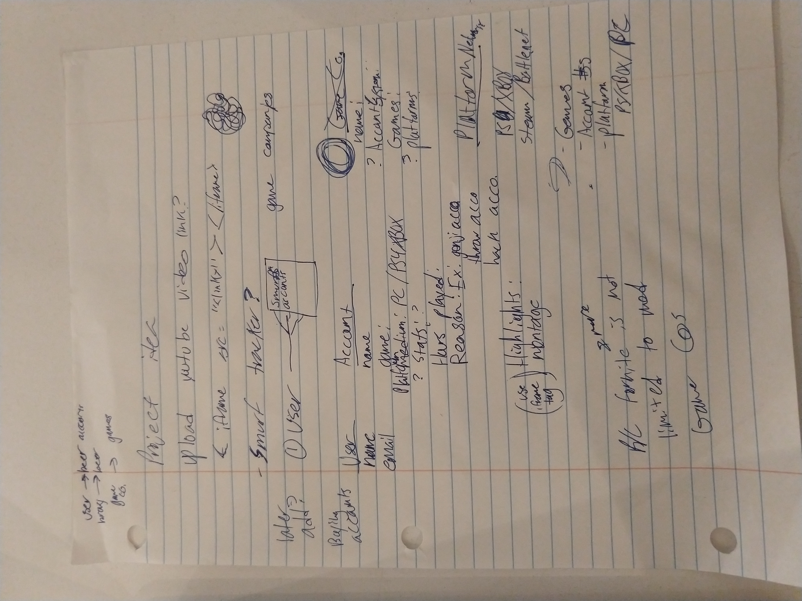
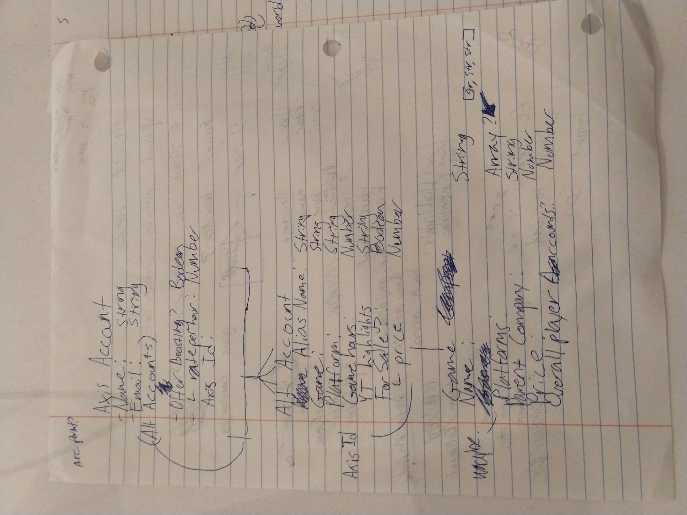
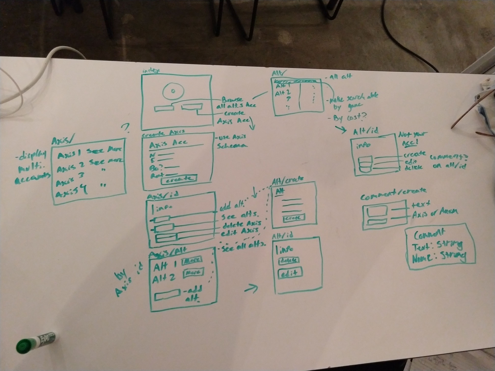
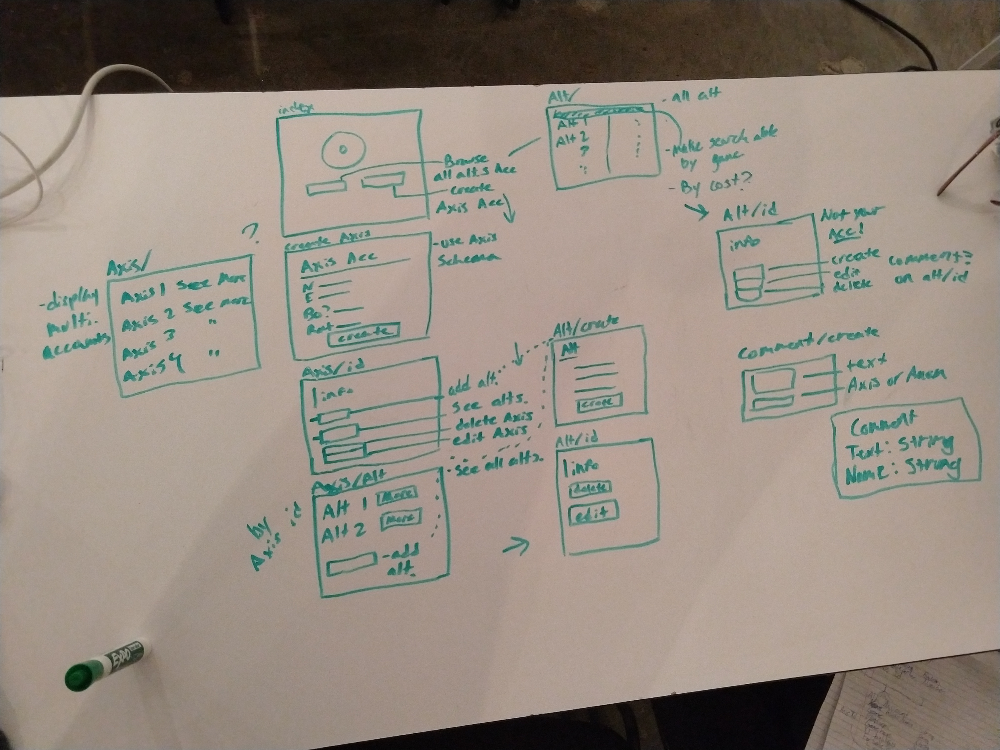
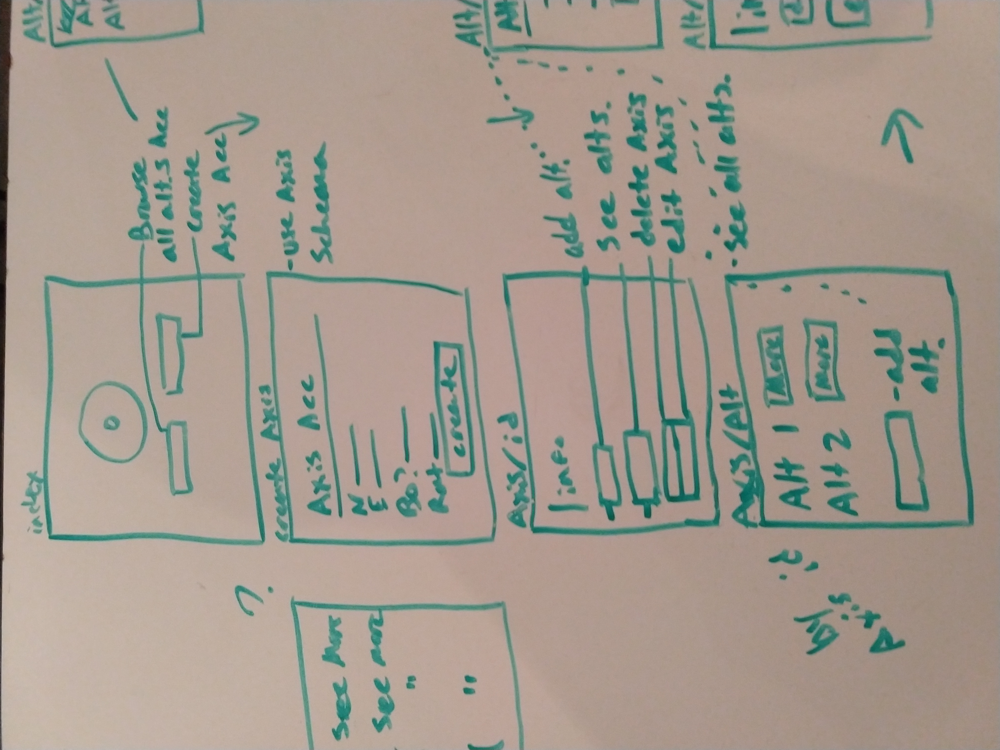
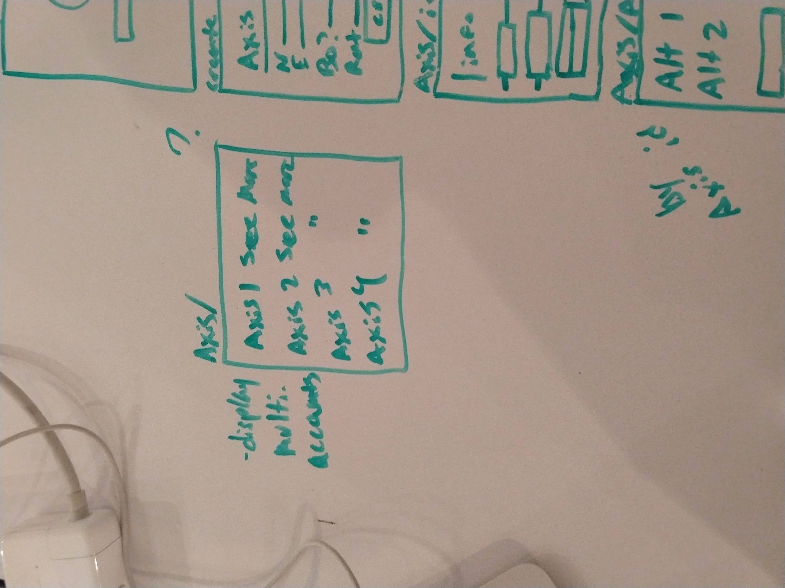
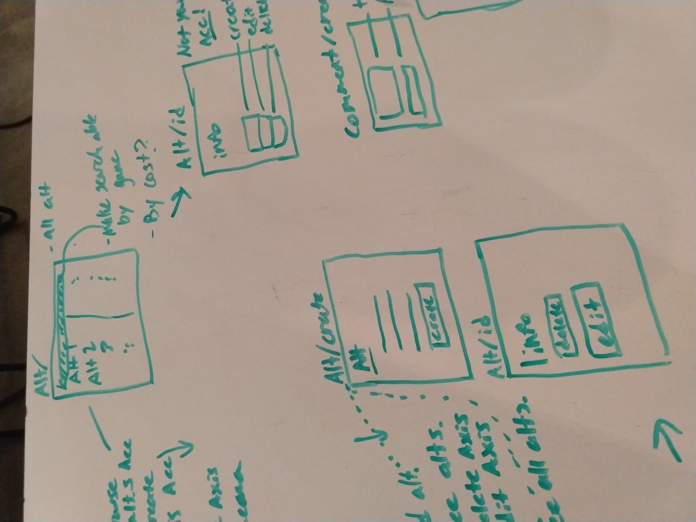
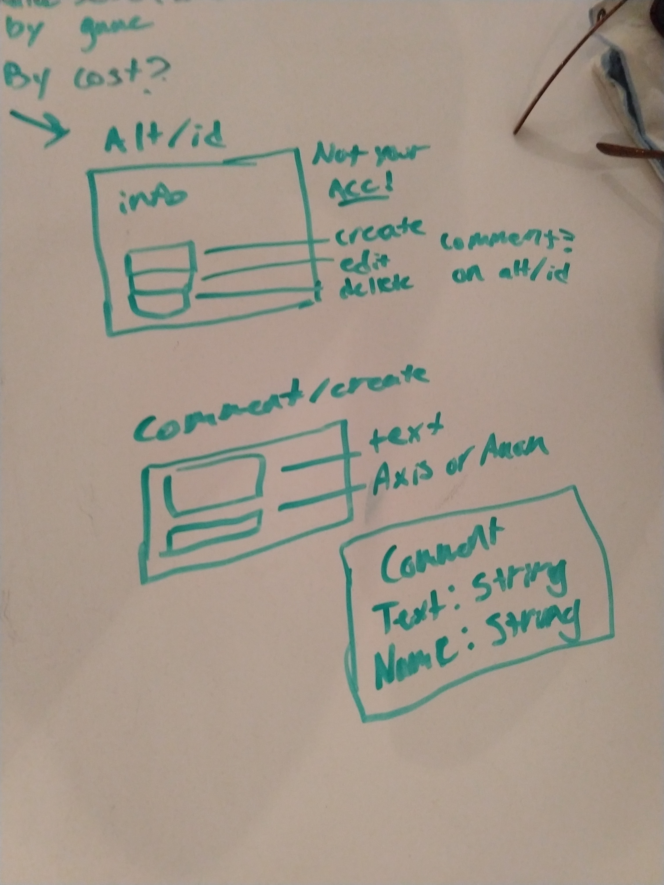
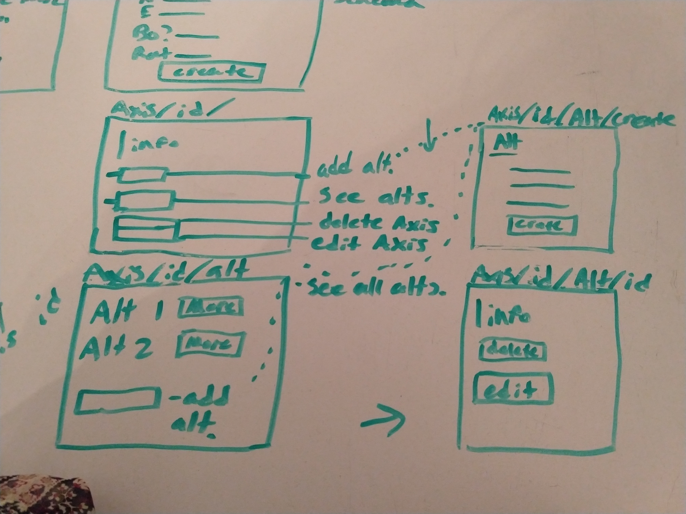

# SEI-Project-2-Grindhouse
## Overview

For project #2, I created a website with a remote database where users can perform CRUD on alt accounts, axis accounts, and comments.

I had plans for a better website, but had to scale back due to time and difficulty with the assignment. Grindhouse was supposed to be like a blackmarket for gamers looking for accounts to buy or acquiring another gamer's assistance to raise their game account level in some form in exchange for money. Each user was going to have a main account called an Axis account, their central hub. Each Axis account could offer game boosting services and have one or more Alt accounts connected to it. The Alt account displays a single game account that the user has access to. Many gamers have multiple alternate accounts nowadays for various different reasons: playing with friends, having a high level account, or only playing a certain way on it are some of them. Axis users displays the general Alt account information and can even connect a YouTube highlights video to display. The video link has to be an embed link, not a watch link from the URL address bar. The Alt accounts could be purchased by other Axis users. Finally there was also supposed to be a comments section for each Alt account where Axis users could comment about the specific Alt account.

This version is the scaled back version though. All the schemas have been separated, nothing is nested, no ObjectId used. Users can perform CRUD on all three schemas equally.

**Live Site:** <https://guarded-oasis-67077.herokuapp.com/>

## Technologies Used

  * Languages - HTML5, CSS3, Javascript, Mongo, Express
  * Project Planning & User Stories - [Trello](https://trello.com/b/ApDmWoOo/sei-project-two)
  * Sublime Text 3

## Features

  * CRUD
  * Web Navigation
  * Displays YouTube links

## Prework

## Future Development

  * Have Alt accounts nested with an Axis account
  * Have comments nested to an Alt account
  * Be able to buy an Alt account from another Axis account and add it to your other Alt accounts connected to your Axis account